* Table of Contents
{:toc}

## 1. Introduction

Welcome to the User Guide of **Homerce**!

Are you an independent home-based beauty salon owner, scrambling between your calendar, client contacts, 
and notebook to keep track of all your appointments, revenue and expenses? 
Do you spend hours tabulating all your revenue and expenses just to get an idea of how your business is doing?
Fret not, our application, Homerce, will reduce the hassle of managing your business and save your valuable time. 
Homerce is an all-in-one application that helps home-based beauty salon owners consolidate their business details - 
such as their appointments, revenue and expenses - into a single application. 

The application uses a Command Line Interface (CLI); this means that you operate the application by typing commands 
into a Command Box. If you are fast at typing, you can operate the application faster than other Graphical User Interface 
(GUI) applications; GUI applications allow users to interact with the application through graphical icons such as buttons.

If you are interested, jump to [Section 2 - Quick Start](#2-quick-start) to learn how to start managing your business using Homerce.

--------------------------------------------------------------------------------------------------------------------

## 2. Quick start

This section gives you step-by-step instructions on how to download and open the application.

1. Ensure you have Java `11` or above installed in your Computer. You may install it [here](https://www.oracle.com/java/technologies/javase-jdk11-downloads.html). 

2. Download the latest `Homerce.jar` [here](https://github.com/AY2021S1-CS2103T-W13-3/tp/releases).

3. Copy the file to the folder you want to use as the _home folder_ for Homerce.

4. Double-click the file to start the app. If you are using Windows, please ensure that your Computer's Display Settings are set to 100%. 

5. A GUI similar to Figure 1 below should appear in a few seconds. Note how the app contains some sample data.   
   
   _Figure 1 - GUI of Homerce_
   
6. Type your command into the command box at the bottom of the screen, and press `Enter` on your keyboard to execute it. E.g. typing `help` and pressing `Enter` will open a help window. 

7. Refer to [Section 4 - Features](#4-features) for details on the commands you can use for each feature.    

--------------------------------------------------------------------------------------------------------------------
## 3. About

### 3.1. Structure of this document

We have structured this User Guide in a way to help you find what you need easily and quickly. 
In the next subsection, [Section 3.2 - reading this document](#32-reading-this-document), you can find several useful tips on how to read this guide.
The following section, [Section 4 - Features](#4-features), documents the seven main features in **Homerce**, namely:

* Service Management

* Appointment Tracking

* Revenue Tracking

* Expense Tracking

* Client Management

* Schedule Viewing

* Finance Tracking

### 3.2. Reading this document

This section introduces you to some technical terms, symbols and syntax that are used throughout the guide. You may want to
familiarize yourself with them before moving to the next section. 

#### 3.2.1. Terminology related to the GUI

Figure 2 shows the GUI of **Homerce**, annotated with a description of each GUI component.

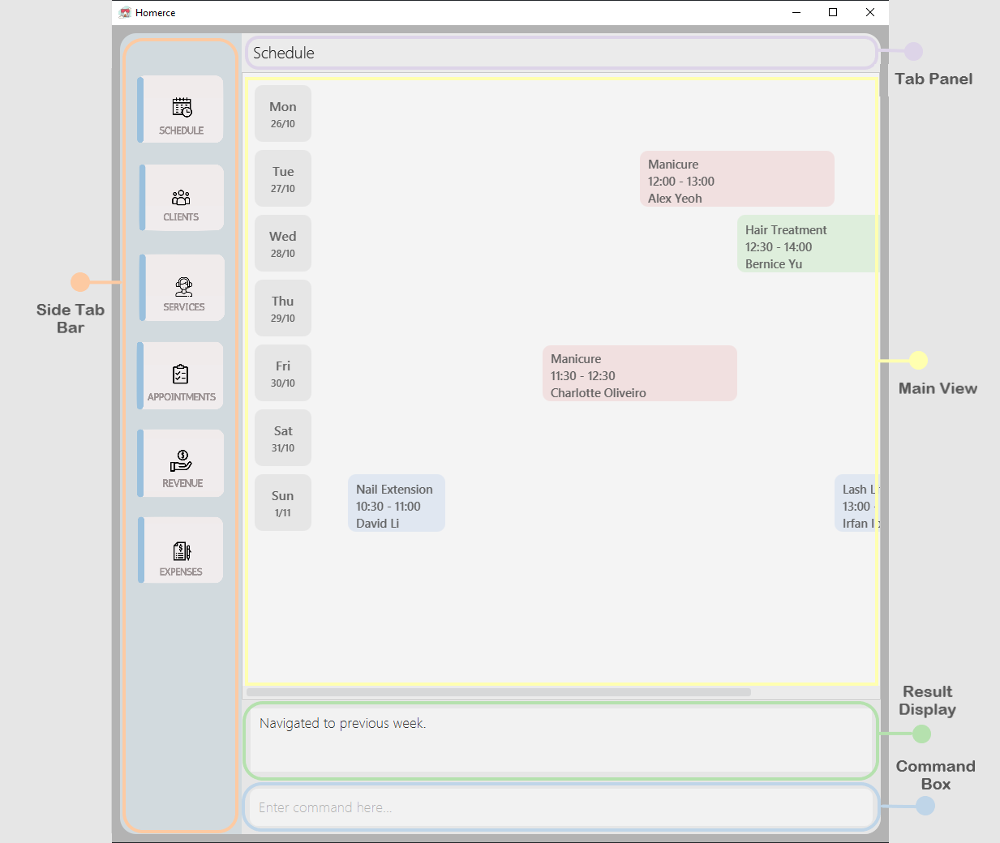  
_Figure 2 -  Annotated GUI of Homerce_

#### 3.2.2. General Symbols and Syntax 

The table below explains the general syntax used throughout the user guide.

| Syntax |  What it means |
|----------|-------------|
| `command` |  A grey highlighted block specifies a executable command that can be entered into the command box.  |
| _italics_ | Italicised text indicates that the text has a definition specific to Homerce. |
|
 :information_source: 
  | An exclamation mark indicates that the following text is important. |

#### 3.2.3. Command Syntax and Usage

The table below explains some important technical terms to help you understand and use commands in Homerce.

| Technical Term | What it means |
| ---------------| --------------|
| Command Word | The first word of a command. It determines the action that Homerce should perform. |
| Prefix | The characters at the start of a parameter. It distinguishes one parameter from another.|
| Parameter | The word following each prefix. They are values given to a command to perform the specified action.|

**Example:**  
`addexp d/DESCRIPTION f/ISFIXED v/VALUE dt/DATE [t/TAG]`

**Breakdown:** 
* Command Word - `addexp`  
* Prefixes - `d/`, `f/`, `v/`, `dt/`, `t/`   
* Parameters - `DESCRIPTION`, `ISFIXED`, `VALUE`, `DATE`, `TAG`

The following points explain the format of a command. 
More examples will be provided for each command in [Section 4 - Features](#4-features).

1. Words in `UPPER_CASE` are the parameters to be supplied 
    - In `deletesvc s/SERVICE_CODE`, `SERVICE_CODE` is a parameter and the command can be used as `deletesvc s/SC001`.

2. Items in square brackets are optional. 
    - `v/VALUE [t/TAG]` can be used as `v/15 t/equipment` or as `v/15`.

3. Items with `…​` after them can be used multiple times, including zero times. 
    - `[t/TAG]…​` can be used as ` ` (i.e. 0 times), `t/blacklist`, `t/VIP t/friend` etc.

4. Parameters can be in any order. 
    - If the command specifies `d/DESCRIPTION dt/DATE`, `dt/DATE d/DESCRIPTION` is also acceptable.
    
5. Square brackets with asterisks indicate that only one of the parameters in them should be specified 
    - Only one parameter among `[t/TITLE]* [d/DURATION]* [p/PRICE]*` should be entered.

## 4. Features

This section contains all the information about the features of **Homerce**. 
You may enter a command into the _Command Box_ to use each feature or sub-feature.

### 4.1. Service Management

This feature allows you to manage the services that your home-based beauty salon provides. You can record the 
following information about your services: `TITLE`, `DURATION` and `PRICE`.

#### 4.1.1. Service Management Command Parameters

Before you dive into using the feature, you may want to have a look at the common parameters used in this feature.
The table below shows a list of command parameters that will be used in this feature.

| Parameter Name | Description | Example
|---------|---------|---------
|`TITLE`| The title of the service you are providing. It must be alphanumeric words not more than 50 characters long.|E.g `Lash Lift`
|`DURATION`| The duration of the service must be in half hour intervals.| E.g `1.5`
|`PRICE`| The revenue received from the service.     It must be in dollars.| E.g `5.50`
|`SERVICE_CODE`| The service code is the code that identifies a particular type of service provided.     It must be an alphanumeric word of 5 characters long.| E.g. If you have added an eyelash extension service into Homerce and its service code is `SC001`.     Typing `SC001` would refers to the eyelash extension service.
|`INDEX`| The index number of the service in the displayed service list.    The first entry of the list has an index number of `1` and all entries are listed in increasing index numbers. | E.g `5`

#### 4.1.2. Add a new service: `addsvc`

You can use this command to add a new service Homerce.

Format: `addsvc t/TITLE du/DURATION p/PRICE`

**:information_source: Note:** 
 
* Refer to [Service Management Command Parameters](#411-service-management-command-parameters) for more details about each parameter.

Example:
Let's say you have a service with the following information you want to add into Homerce. You can follow these instructions.

| Service | |
|---------|--------- |
|`TITLE`| Lash Lift |
|`DURATION`| 0.5 |
|`PRICE`| 38 |

Adding the above service:
1. Type `addsvc t/Lash Lift du/0.5 p/38` into the *Command Box*.
2. Press `Enter` to execute.

Outcome:
1. The Result Display will show success message.
2. Homerce will switch to the Services Tab.
3. You can now see all your services including the newly added service.

{Example outcome screenshot}

#### 4.1.3. Edit an existing service: `editsvc`

You can use this command to edit an existing service in Homerce.

Format: `editsvc INDEX [t/TITLE]* [du/DURATION]* [p/PRICE]*`

**:information_source: Note:** 
 
* You are unable to edit an existing service's service code. Service codes are automatically generated by Homerce when adding a new service.
* Refer to [Service Management Command Parameters](#411-service-management-command-parameters) for more details about each parameter.

Example:
Let's say you have entered the wrong duration for an added service and want to change it to 0.5 hours instead
of 1 hour. You can follow these instructions.

Editing an existing service:
1. Type `editsvc 1 du/0.5` into the *Command Box*.
2. Press `Enter` to execute.

Outcome:
1. The Result Display will show a success message.
2. Homerce will switch to the Services Tab.
3. You can now see all your services including the edited service.

{Example outcome screenshot}

#### 4.1.4. Delete an existing service: `deletesvc`

You can use this command to delete an existing service in Homerce.

Format: `deletesvc INDEX`

**:information_source: Note:** 
 
* Homerce will not allow the deletion of a service which is already scheduled for an upcoming appointment.
* Refer to [Service Management Command Parameters](#411-service-management-command-parameters) for more details about each parameter.

Example:
Let's say you are no longer providing a particular service and want to delete it from Homerce. You can follow these
instructions.

Deleting an existing service:
1. Type `deletesvc 1` into the *Command Box*.
2. Press `Enter` to execute.

Outcome:
1. The Result Display will show a success message.
2. Homerce will switch to the Services Tab.
3. You can now see that the service with service code SC001 has been deleted from Homerce.

{Example outcome screenshot}

#### 4.1.5. Find a service by keyword: `findsvc`

You can use this command to find specific services which matches either the title or service code that you provide.

Format: `findsvc [t/TITLE]* [s/SERVICE_CODE]*`

**:information_source: Note:** 
 
* Refer to [Service Management Command Parameters](#411-service-management-command-parameters) for more details about each parameter.

Example: 
Let's say you want to find all the services that contain nail in its title from the list of services. You can
follow these instructions.

Finding a service:
1. Type `findsvc t/nail` into the *Command Box*.
2. Press `Enter` to execute.

Outcome:
1. The Result Display will show a success message.
2. Homerce will switch to the Services Tab.
3. You can now see the services in your list of services that contain nail in its title.

{Example outcome screenshot}

#### 4.1.6. List all existing services: `listsvc`

You can use this command to navigate to the Services Tab and display all your added services in Homerce.

Format: `listsvc`

Example:
Let's say you are in another tab and want to look at the list of all services. You can follow these instructions.

Listing all services:
1. Type `listsvc` into the *Command Box*.
2. Press `Enter` to execute.

Outcome:
1. The Result Display will show a success message.
2. Homerce will switch to the Services Tab.
3. You can now see all your services.

{Example outcome screenshot}

#### 4.1.7. Clear all existing services: `clearsvc`

You can use this command to clear and delete the all the services in Homerce.

Format: `clearsvc`

**:information_source: Note:** 
 
* You are unable to clear services if there are any existing services that have been scheduled in your upcoming appointments. Please remove these
appointments before proceeding to clear your services.

Example:
Let's say you want to delete all the services from your list of services and start from an empty list of services. You can
follow these instructions.

Clearing all services:
1. Type `clearsvc` into the *Command Box*.
2. Press `Enter` to execute.

Outcome:
1. The Result Display will show a success message.
2. Homerce will switch to the Services Tab.
3. You can see that the list of services is now empty.

{Example outcome screenshot}

### 4.2. Appointment Tracker

Scheduling appointments is an essential part of your beauty salon and
Homerce makes it easy to keep track of your upcoming appointments with
your customers. You can add appointments for a particular service and
client, mark it as done, and Homerce will automatically credit the revenue
into the revenue tracker.

#### 4.2.1. Appointment Tracker Command Parameters

This feature uses a number of parameters, which are detailed below.

| Parameter Name | Description | Example
|---------|---------|---------
|`DATE`  | The date of the appointment.     It must be in the format of `dd-MM-yyyy`. | E.g. Typing `28-09-2020` would mean 28 September 2020.
|`TIME` | The time of the appointment.     It must be in the format of `HHMM` | E.g. Typing `1730` would mean 5:30 PM.      E.g. Typing `0900` would mean 9:00 AM.
|`SERVICE_CODE`| The service code is the code that identifies the type of service provided.     It must be alphanumeric words of 5 characters long. | E.g. If you have added an eyelash extension service into Homerce and its service code is `SC001`.     Typing `SC001` would refer to the eyelash extension service.
|`PHONE_NUMBER` | The phone number of the client.     It must be a 8-digit number starting with 6, 8, or 9.| E.g. Typing `81281234` or `91235678` is a valid phone number.      E.g. Typing `999`or `800012345` would not be a recognised number.
|`NAME` | The name of the client booking the appointment.     It must consist alphanumeric characters not more than 100 characters long. | E.g. If a client with the name `Hartin Menz` called to book an appointment, the same name `Hartin Menz` would be used as the parameter for `NAME`.
|`INDEX` | The index of the appointment in the displayed list.     It must be a valid index number. | E.g. Typing `2` would mean the appointment with index-2 in the displayed list.

#### 4.2.2. Add an appointment: `addapt`

When a new or existing client calls to make a booking for your services, use this
command to add details of the appointment into the appointment tracker.

Format : `addapt dt/DATE t/TIME s/SERVICE_CODE p/PHONE_NUMBER`

 

**:information_source: Note:** 
 
* Refer to [Appointment Tracker Command Parameters](#421-appointment-tracker-command-parameters) for more details about each parameter.

 

Example:

Let's say your client called to make an appointment.
You can follow these instructions to add his/her appointment details into Homerce.

| Appointment | |
|---------|--------- |
|`DATE`| 28-10-2020 |
|`TIME`| 1300 |
|`SERVICE_CODE`| SC001 |
|`PHONE_NUMBER`| 83232656 |

Steps:
1. Type `addapt dt/28-10-2020 t/1300 s/SC001 p/83232656` in the command box.
1. Press `Enter` on your keyboard.

Outcome:
1. The Result Display will show a success message.
1. Homerce will switch to the appointment tab.
1. You can now see all your appointments including the newly added appointment.

{Example outcome screenshot}

#### 4.2.3. List all appointments: `listapt`

Use this command to see your list of all your upcoming appointments.

Format : `listapt`
 
Example:

Let's say you want to list all your appointments stored in Homerce.
You can follow these instructions.

Steps:
1. Type `listapt`.
1. Press `Enter` on your keyboard.

Outcome:
1. The Result Display will show a success message.
1. Homerce will switch to the appointment tab.
1. You can now see all your appointments stored in Homerce.

{Example outcome screenshot}

#### 4.2.4. Find an appointment: `findapt`

Use this command to find a specific appointment which matches the description you provide
to Homerce. To find all the appointments belonging to a particular week, use the `schedule`
command instead.

Format : `findapt [p/PHONE_NUMBER]* [n/NAME]* [dt/DATE]* [s/SERVICE_CODE]*`

 

**:information_source: Note:** 
 
* Refer to [Appointment Tracker Command Parameters](#421-appointment-tracker-command-parameters) for more details about each parameter.

 

Example:

Let's say you have a number of appointments stored in Homerce and you want to search for those booked by the phone
number 82341245. You can follow these instructions to list all the appointments which match your search criteria.

Steps:
1. Type `findapt p/82341245` in the command box.
1. Press `Enter` on your keyboard.

Outcome:
1. The Result Display will show a success message.
1. Homerce will switch to the appointment tab.
1. You can now see all your appointments made by the number `82341245`.

{Example outcome screenshot}

#### 4.2.5. Edit an appointment: `editapt`

When a new or existing client calls to edit a booking he or she had made, use this
command to edit details of the appointment.

Format : `editapt INDEX [dt/DATE] [t/TIME] [p/PHONE_NUMBER]`

 

**:information_source: Note:** 
 
* Refer to [Appointment Tracker Command Parameters](#421-appointment-tracker-command-parameters) for more details about each parameter.

 

Example:

Let's say you searched for the appointment which you want to edit in Homerce.
You searched for the appointment in Homerce with `listapt` or `findapt`, see that it's index is 1,
and you want to edit it with the following details:

| Appointment | |
|---------|-------- |
|`INDEX`| 1 |
|`DATE`| 28-10-2020 |
|`TIME`| 1300 |
|`PHONE_NUMBER`| 93451222 |

Steps:
1. Type `editapt 1 dt/28-10-2020 t/1300 p/93451222` in the command box.
1. Press `Enter` on your keyboard.

Outcome:
1. The Result Display will show a success message.
1. Homerce will switch to the appointment tab.
1. You will see your edited appointment displayed alongside other appointments in your tracker.

{Example outcome screenshot}

#### 4.2.6. Mark an appointment as done: `done`

After an appointment with a client has been completed, use this command to credit the revenue from the service and mark the appointment
as done.

Format : `done INDEX`

 

**:information_source: Note:** 
 
* Refer to [Appointment Tracker Command Parameters](#421-appointment-tracker-command-parameters) for more details about each parameter.

 

Example:

Let's say you just finished an appointment with a client. After finding the appointment in Homerce
with `listapt` or `findapt`, you see that the appointment has index 5. You can follow these instructions 
to mark that appointment as done.

Steps:
1. Type `done 5` in the command box.
1. Press `Enter` on your keyboard.

Outcome:
1. The Result Display will show a success message.
1. Homerce will switch to the appointment tab.
1. You will see your appointment marked as done, displayed alongside other appointments in your tracker.

{Example outcome screenshot}

#### 4.2.7. Mark an appointment as not done: `undone`

In the event that an appointment was marked as done by accident, you can
use this command to revert this and ensure your appointment is still
scheduled to take place.

Format : `undone INDEX`

 

**:information_source: Note:** 
 
* Refer to [Appointment Tracker Command Parameters](#421-appointment-tracker-command-parameters) for more details about each parameter.

 

Example:

Let's say you just marked an appointment as done by accident. You searched for that
appointment with `listapt` or `findapt` and the one you want to change has index 3.
You then follow these instructions to undo it.

Steps:
1. Type `undone 3` in the command box.
1. Press `Enter` on your keyboard.

Outcome:
1. The Result Display will show a success message.
1. Homerce will switch to the appointment tab.
1. You will see your appointment marked as not done, alongside other appointments in your tracker.

{Example outcome screenshot}

#### 4.2.8. Delete an existing appointment: `deleteapt`

If a client informs you that he or she wants to cancel an appointment, you can
use this command to delete that particular command from the appointment tracker.

Format : `deleteapt INDEX`

 

**:information_source: Note:** 
 
* Refer to [Appointment Tracker Command Parameters](#421-appointment-tracker-command-parameters) for more details about each parameter.

 

Example:

Let's say you a client called to cancel his/her appointment. After finding the appointment in Homerce
with `listapt` or `findapt`, you see that the appointment to delete has index 2. You can follow these instructions 
to delete that appointment.

Steps:
1. Type `deleteapt 2` in the command box.
1. Press `Enter` on your keyboard.

Outcome:
1. The Result Display will show a success message.
1. Homerce will switch to the appointment tab.
1. You will see the rest of your appointments in your tracker, with the one with index 2 removed.

{Example outcome screenshot}

#### 4.2.9. Clear all appointments: `clearapt`

In the event that you want to reset the entire list of appointments
in Homerce, you may use this command to delete all prior and upcoming
appointments with your clients.

Format : `clearapt`

Example:

Let's say you want to clear all appointments stored in Homerce.
You can follow these instructions to do so.

Steps:
1. Type `clearapt` in the command box.
1. Press `Enter` on your keyboard.

Outcome:
1. The Result Display will show a success message.
1. Homerce will switch to the appointment tab.
1. You will no appointments listed in the tracker.

{Example outcome screenshot}

### 4.3. Revenue Tracker

Homerce knows that revenue tracking is very important for your business.
Thus, this feature allows you to track the revenue that you have generated effortlessly.
Revenue will be automatically recorded when an appointment is indicated as done.

#### 4.3.1. Revenue Tracker Command Parameters

Before you dive into using the feature, you may want to have a look at the common parameter used in this feature.
The table below shows a list of command parameters that will be used in this feature.

| Parameter Name | Description | Example
|---------|---------|---------
|`DATE`  | The revenue earned date.     It must be in the format of `dd-MM-yyyy`. | E.g. Typing `22-10-2020` would mean 22 October 2020.
|`SERVICE_CODE`| The service code is the code that identifies a particular type of service provided.     It must be alphanumeric words of 5 characters long. | E.g. If you have added an eyelash extension service into Homerce and its service code is `SC001`.     Typing `SC001` would refers to the eyelash extension service.
|`ORDER` | The order refers to ascending or descending.     It must be in the format of `asc` or `desc` | E.g. Typing `asc` would mean ascending.      E.g. Typing `desc` would mean descending.
|`INDEX`| The index number of the revenue in the displayed revenue list.    The first entry of the list has an index number of `1` and all entries are listed in increasing index numbers. | E.g `5`

#### 4.3.2. Find a revenue : `findrev`

You can use this command to find revenues by 'date' or 'service code' in Homerce.

Format : `findrev [dt/DATE]* [s/SERVICE_CODE]*`

**:information_source: Note:** 
* Refer to [Revenue Tracker Command Parameters](#431-revenue-tracker-command-parameters) for more details about each parameter.

Example :

You have just stopped operations for the day, and you wish to view all the revenues generated for today (22-10-2020).

You can follow the steps below to get the list of revenues for the day.

Steps :
1. Type `findrev dt/22-10-2020` into the _Command Box_.
1. Press `Enter` to execute. 

Outcome : 
1. It will display a success message in the _Result  Display_.
1. Homerce will list out all the revenue for 22-10-2020 in the _Revenue_ tab.  

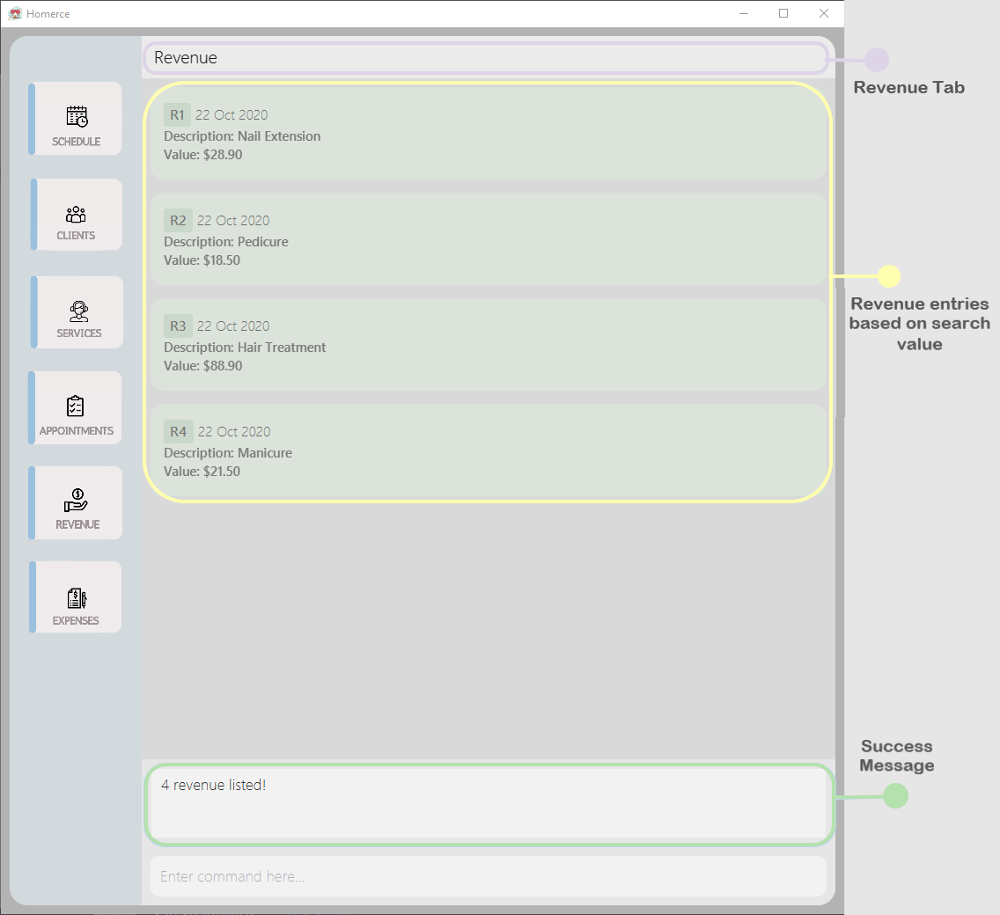  
*Figure 4.3.2.1 - GUI outcome for `findrev`*

#### 4.3.3. Sort revenues: `sortrev`

You can use this command to sort the list of revenue in ascending or descending order by value in Homerce.

Format : `sortrev ORDER`

**:information_source: Note:** 
* Refer to [Revenue Tracker Command Parameters](#431-revenue-tracker-command-parameters) for more details about each parameter.

Example :

You wish to view your revenue from highest to lowest cost to determine which revenue contributes most to your profits.

You can follow the steps below to sort your list of revenues.

Steps :
1. Type `sortrev desc` into the _Command Box_.
1. Press `Enter` to execute. 

Outcome : 
1. It will display a successful message in the _Result Display_.
1. Homerce will list out all the revenue entries sorted from highest to lowest cost in the _Revenue_ tab.

.png)  
*Figure x - GUI outcome for `sortrev`*

#### 4.3.4. List revenues : `listrev`

You can use this command to list all your revenue entries in Homerce. The list will be sorted by descending chronological order.

Format : `listrev`

Example :

You wish to list your revenues to view all the earnings that you currently have.

You can follow the steps below to list your all your revenue entries.

Steps :
1. Type `listrev` into the _Command Box_.
1. Press `Enter` to execute. 

Outcome : 
1. It will display a successful message in the _Result Display_.
1. Homerce will list out all your revenue entries in the _Revenue_ tab.

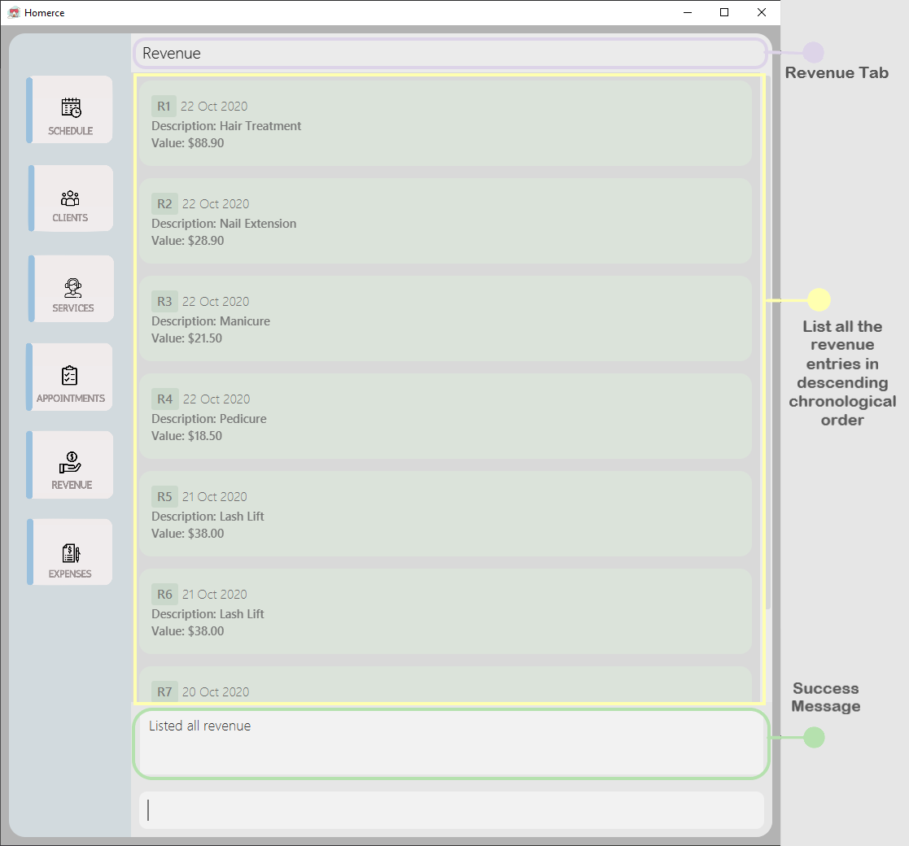  
*Figure x - GUI outcome for `listrev`*

#### 4.3.5. Clear revenue : `clearrev`

You can use this command to clear all revenue entries in Homerce.

Format : `clearrev`

Example :

You wish to remove all revenues entries in Homerce and restart your revenue management from scratch.

You can follow the steps below to clear all your revenue entries.

Steps :
1. Type `clearrev` into the _Command Box_.
1. Press `Enter` to execute. 

Outcome : 
1. It will display a successful message in the _Result Display_.
1. Homerce will clear all the revenue data.

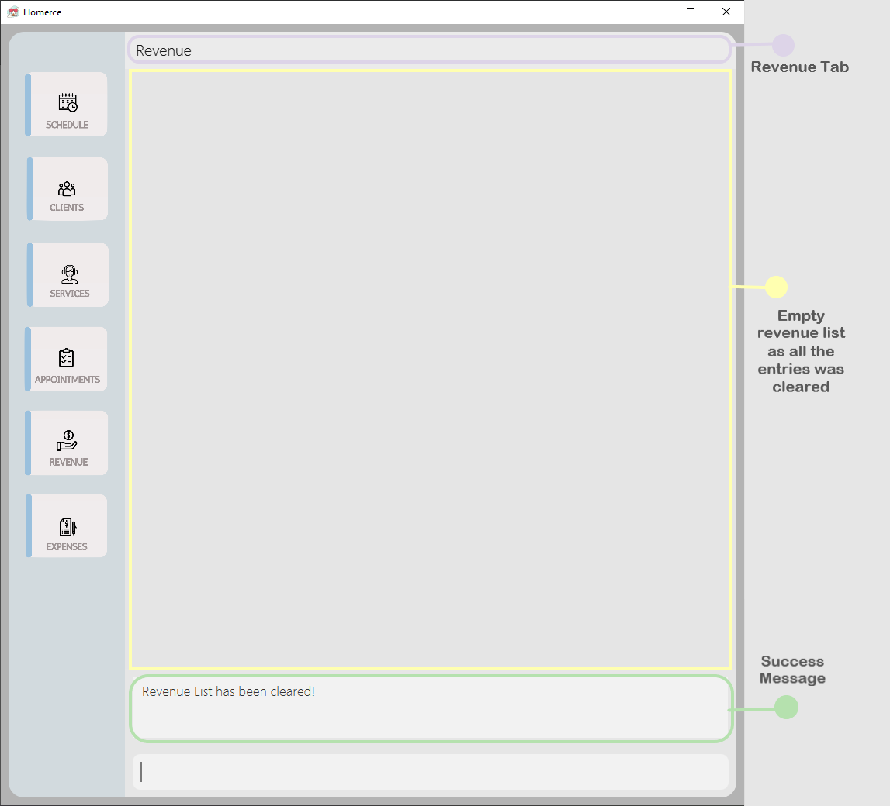  
*Figure x - GUI outcome for `clearrev`*

### 4.4 Expense Tracker

Homerce understands that expense tracking is essential in managing your business expenditure.
Thus, this feature allows you to track your operational expenses seamlessly and with ease.   
Our expense tracker supports both fixed expenses that recur monthly, and one-time expenses that are incurred only once.
A fixed expense only has to be added once, and Homerce will automatically record the same fixed expense for you every month.
   You can record the following information about your expenses: `DESCRIPTION`, `ISFIXED`, `VALUE`, `DATE` and `TAG`. 

#### 4.4.1. Expense Tracker Command Parameters

Before you dive into using the feature, you may want to have a look at the common parameters used in this feature.
The table below shows a list of command parameters that will be used.

| Parameter Name | Description | Example
|---------|---------|---------
|`DESCRIPTION`  | The description of the expense.    It must be alphanumeric words not more than 50 characters long. | E.g. Typing `Conditioner` as the description indicates that the expense was made on a bottle of Conditioner.
|`IS_FIXED`| The indication of whether an expense is fixed.     It must be in the format of `y` or `n`.    *Note: A fixed expense is an expense that recurs monthly. For example, the monthly air-conditioning bill is a fixed expense as it recurs every month, while a box of tissues is a one-time expense and should not be indicated as fixed.* | E.g. Typing `y` would mean the expense is fixed.  You only have to add a fixed expense once, as Homerce will automatically record the expense for you every month.     E.g. Typing `n` would mean the expense is not fixed.
|`VALUE` | The value refers to the monetary value of the expense.     It must consist only of numeric characters and have up to two decimal places. | E.g. Typing `10.00` would mean the expense costs $10.00.
|`DATE` | The date of the expense.     It must be in the format of `dd-MM-yyyy`. | E.g. Typing `28-09-2020` would mean the expense was made on 28 September 2020.
|`TAG` | The tag you want to attach to the expense.     It must be a single alphanumeric word not more than 30 characters long.    *Note: Tags are used to categorise and organize your expenses. For example, an expense on eyelash glue can be tagged under 'lashsupplies'.  Tags are optional, and expenses without a tag specified will automatically be categorized under 'others'.*| E.g. Typing `equipment` would mean that the expense is tagged as an equipment.
|`INDEX` | The index of the expense in the displayed list.     It must be a valid index number. | E.g. Typing `2` would mean the expense with index-2 in the displayed list.
|`ORDER` | The order refers to ascending or descending. It is used to sort expenses based on their value.     It must be in the format of `asc` or `desc`. | E.g. Typing `asc` would mean ascending. Expenses will be displayed from lowest to highest value.     E.g. Typing `desc` would mean descending. Expenses will be displayed from highest to lowest value.

#### 4.4.2. Add an expense `addexp`

You can use this command to add a new expense to Homerce.

Format : `addexp d/DESCRIPTION f/IS_FIXED v/VALUE dt/DATE [t/TAG]`

**:information_source: Note:** 
 
* If no tag is entered, the expense will automatically be tagged under 'others'.
* Refer to [Expense Tracker Command Parameters](#441-expense-tracker-command-parameters) for more details about each parameter.

Example :

You just purchased a bottle of conditioner today for $15 (28-10-2020).

You can follow the steps below to add the expense to Homerce.

Steps :
1. Type `addexp d/conditioner f/n v/15.00 dt/28-10-2020 t/hairsupplies` into the _Command Box_.
2. Press `Enter` to execute.

Outcome :
1. Homerce will display a success message, as shown below.

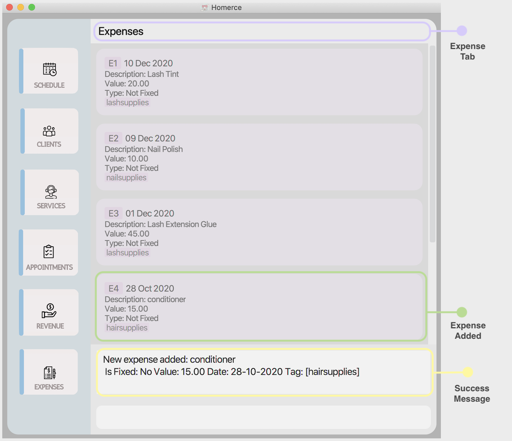  
*Figure x - GUI outcome for `addexp`*

#### 4.4.3. Edit an expense `editexp`

You can use this command to edit an expense in Homerce.

Format : `editexp INDEX [d/DESCRIPTION] [f/IS_FIXED] [v/VALUE] [dt/DATE] [t/TAG]`

**:information_source: Notes:** 
 
* You must enter at least one optional parameter.
* The new value entered will overwrite the existing value.
* Refer to [Expense Tracker Command Parameters](#441-expense-tracker-command-parameters) for more details about each parameter.

Example :

You misspelled the description of an expense when adding it into Homerce, and wish to change it to "Eyelash Curler".

You can follow the steps below to edit the expense.

Steps :
1. Type `editexp 2 d/Eyelash Curler` into the _Command Box_.
2. Press `Enter` to execute.

Outcome :
1. Homerce will display a success message, as shown below.

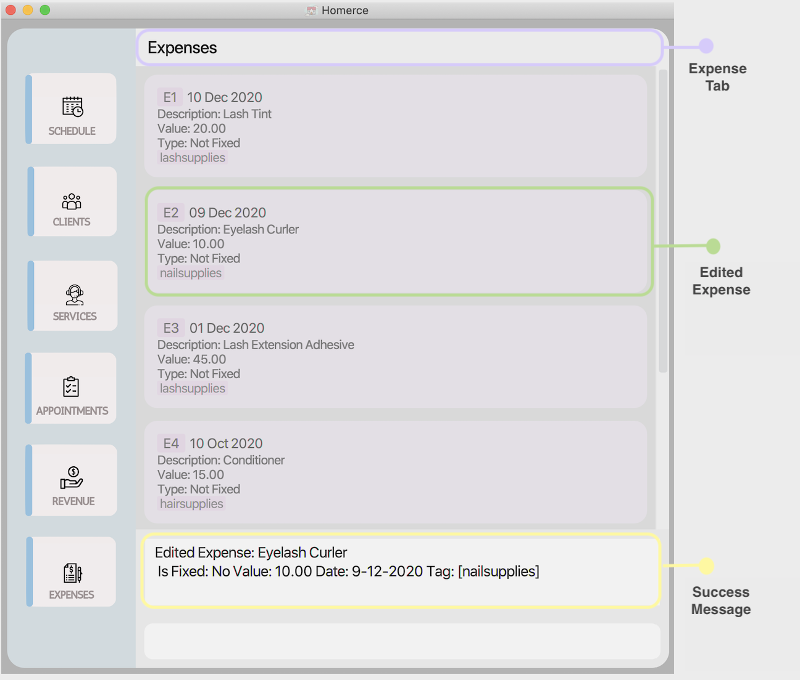  
*Figure x - GUI outcome for `editexp`*

#### 4.4.4. Delete an expense `deleteexp`

You can use this command to delete an expense in Homerce.

Format : `deleteexp INDEX`

**:information_source: Note:** 
 
* Refer to [Expense Tracker Command Parameters](#441-expense-tracker-command-parameters) for more details about each parameter.

Example :

You mistakenly entered the same expense twice and wish to delete one of the entries. 

You can follow the steps below to delete the expense.

Steps :
1. Type `deleteexp 3` into the _Command Box_.
2. Press `Enter` to execute.

Outcome :
1. Homerce will display a success message, as shown below.

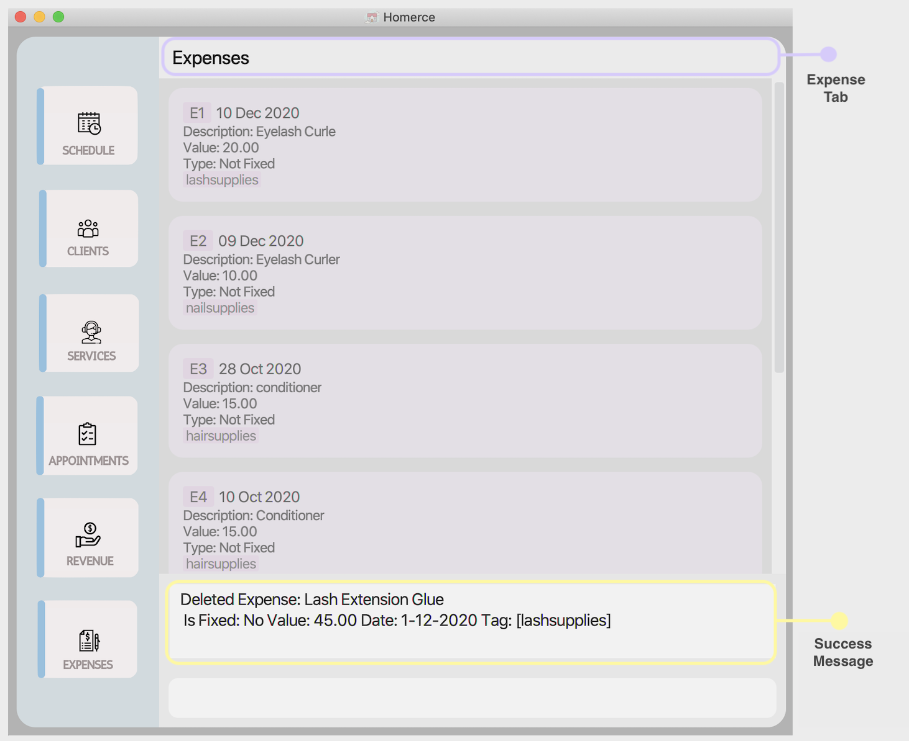  
*Figure x - GUI outcome for `deleteexp`*

#### 4.4.5. Find an expense `findexp`

You can use this command to find an expense in Homerce.

Format : `findexp [d/DESCRIPTION]* [dt/DATE]* [f/IS_FIXED]* [t/TAG]*`

**:information_source: Notes:** 

* You must enter at least one optional parameter.
* Refer to [Expense Tracker Command Parameters](#441-expense-tracker-command-parameters) for more details about each parameter.

Example :

You wish to view all the expenses you incurred today (10-10-2020).

You can follow the steps below to get a list of expenses for the day.

Steps :
1. Type `findexp dt/10-10-2020` into the _Command Box_.
2. Press `Enter` to execute.

Outcome :
1. It will display a success message, as shown below.
2. Homerce will list out all the expenses for 10-10-2020.

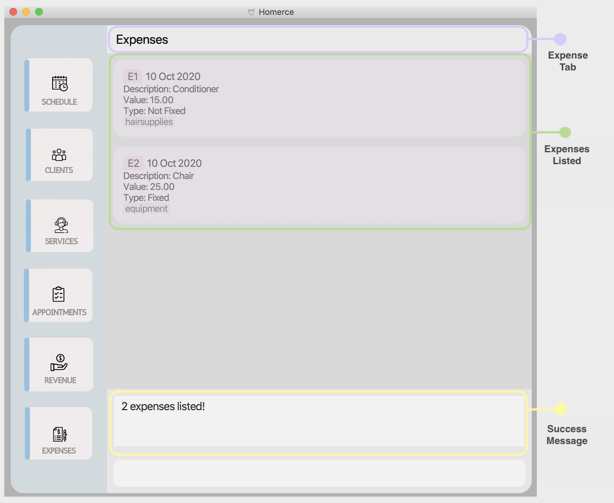  
*Figure x - GUI outcome for `findexp`*

#### 4.4.6. Sort expenses `sortexp`

You can use this command to sort expenses in Homerce.

Format : `sortexp ORDER`

**:information_source: Note:** 
 
* Refer to [Expense Tracker Command Parameters](#441-expense-tracker-command-parameters) for more details about each parameter.

Example :

You wish to view your expenses from highest to lowest cost to determine which expenses are contributing most to your total expenditure.

You can follow the steps below to sort your list of expenses.

Steps :
1. Type `sortexp desc` into the _Command Box_.
2. Press `Enter` to execute.

Outcome :
1. It will display a success message, as shown below.
2. Homerce will list out all the expenses sorted from highest to lowest cost.

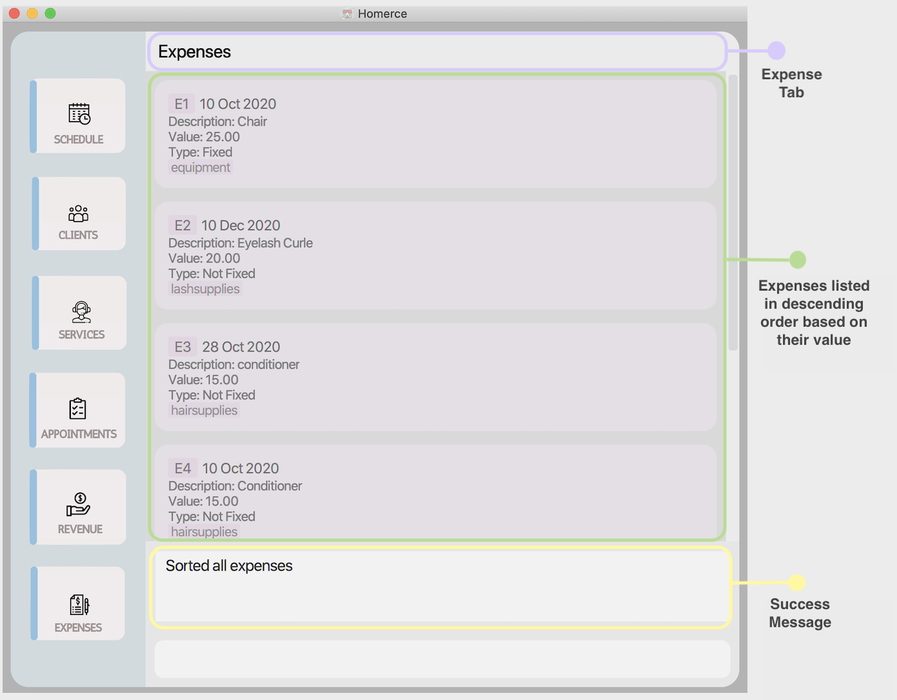  
*Figure x - GUI outcome for `sortexp`*

#### 4.4.7. List expenses `listexp`

You can use this command to list all your expenses in Homerce.

Format : `listexp`

Example :

You wish to list your expenses to view all the expense entries that you currently have.

You can follow the steps below to list your expenses.

Steps :
1. Type `listexp` into the _Command Box_.
2. Press `Enter` to execute.

Outcome :
1. It will display a success message, as shown below.
2. Homerce will list out all your expenses.

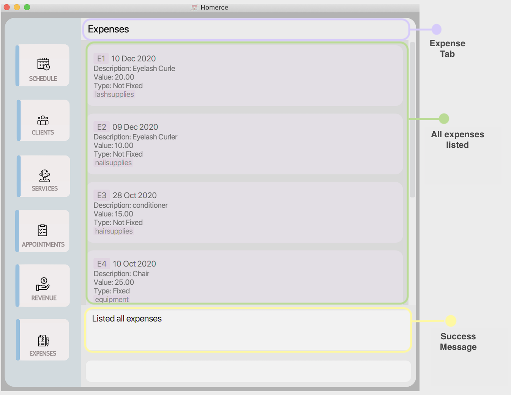  
*Figure x - GUI outcome for `listexp`*

#### 4.4.8. Clear expenses `clearexp`

You can use this command to clear all expenses in Homerce.

Format : `clearexp`

Example :

You wish to remove all expense entries in Homerce and restart your expense tracking from scratch.

You can follow the steps below to clear all your expenses.

Steps :
1. Type `clearexp` into the _Command Box_.
2. Press `Enter` to execute.

Outcome :
1. It will display a success message, as shown below.

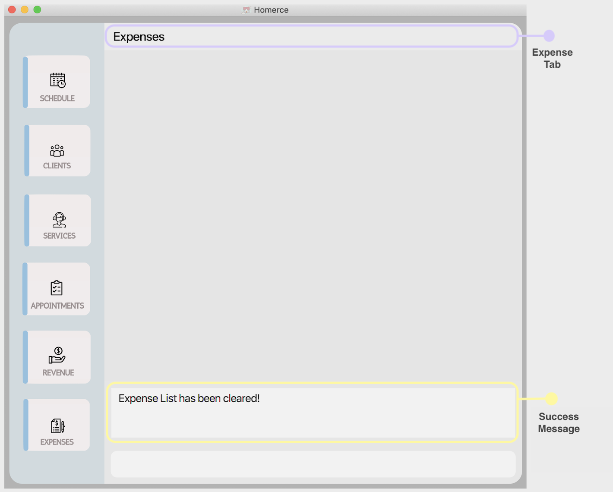  
*Figure x - GUI outcome for `clearexp`*

### 4.5 Client Manager

Homerce knows that managing the contacts of your clients is a must for any business.
Thus, this feature allows you to keep track of all the relevant information needed about your clients.

#### 4.5.1. Client Manager Command Parameters

Before you dive into using the feature, you may want to have a look at the common parameters used in this feature.
The table below shows a list of command parameters that will be used.

| Parameter Name | Description | Example |
|---------|---------|--------- |
|`NAME`  | The name of the client.    It must be an alphanumeric word. | E.g. Typing `John Doe` would represent the name of the client saved in the client manager. |
|`EMAIL`  | The email of the client.   Emails should be in `local-part@domain format`     The `local-part` can only contain alphanumeric characters, and the special characters   +!#$%&'*+/=?\`{}~^.-&#124     The `domain` can only contain:  Alphanumeric characters The following special characters in between: +  dash (-) period (.)   The domain name must also have at least 2 characters and start and end with alphanumeric characters | johnDoe97@example123.com |
|`PHONE` | Phone is the contact number of the client.     It must consist only of numeric characters, and be at least 3 digits long. | E.g. `91234567` would represent the client's phone number. |
|`TAG` | The tag you want to attach to the client.     It must be a single alphanumeric word. | E.g. Typing `friend` would mean that the client is tagged as a friend. |
|`INDEX` | The index of the client in the displayed list.     It must be a valid index number. | E.g. Typing `2` would mean the client with index-2 in the displayed list. |

#### 4.5.2. Add a client `addcli`

You can use this command to add a new client to Homerce.

Format : `addcli n/NAME p/PHONE e/EMAIL [t/TAG]`

**:information_source: Note:** 
 
* Refer to [Client Manager Command Parameters](#451-client-manager-command-parameters) for more details about each parameter.

Example :

A new client just called in to make an appointment .

You can follow the steps below to add the client to Homerce.

Steps :
1. Type `addcli n/John p/91234567 e/john@gmail.com t/new` into the _Command Box_.
2. Press `Enter` to execute.

Outcome :
1. Homerce will display a success message.

{Example outcome screenshot}

#### 4.5.3. Edit a client's details `editcli`

You can use this command to edit an expense in Homerce.

Format : `editcli INDEX [n/NAME] [p/PHONE] [e/EMAIL] [t/TAG]`

**:information_source: Notes:** 
 
* You must enter at least one optional parameter.
* The new value entered will overwrite the existing value.
* Refer to [Client Manager Command Parameters](#451-client-manager-command-parameters) for more details about each parameter.

Example :

You misspelled the name of a client when adding it into Homerce and wish to change it to "Johnny".

You can follow the steps below to edit the client.

Steps :
1. Type `editcli 2 n/Johnny` into the _Command Box_.
2. Press `Enter` to execute.

Outcome :
1. Homerce will display a success message.

{Example outcome screenshot}

#### 4.5.4. Delete a client `deletecli`

You can use this command to delete a client in Homerce.

Format : `deletecli INDEX`

**:information_source: Note:** 
 
* Refer to [Client Manager Command Parameters](#451-client-manager-command-parameters) for more details about each parameter.

Example :

A client repeatedly fails to turn up for his appointments and you wish to delete his contact. 

You can follow the steps below to delete the client.

Steps :
1. Type `deletecli 3` into the _Command Box_.
2. Press `Enter` to execute.

Outcome :
1. Homerce will display a success message.

{Example outcome screenshot}

#### 4.5.5. Find a client `findcli`

You can use this command to find a client in Homerce.

Format : `findcli [n/NAME]* [p/PHONE]*`

**:information_source: Notes:** 

* You must enter at least one optional parameter.
* Refer to [Client Manager Command Parameters](#451-client-manager-command-parameters) for more details about each parameter.

Example :

You have many clients in your client list and wish to find more information on the client named John.

You can follow the steps below to get a list of clients named John

Steps :
1. Type `findcli n/John` into the _Command Box_.
2. Press `Enter` to execute.

Outcome :
1. It will display a success message. 
2. Homerce will list out all the clients with John in their name.

#### 4.5.6. List clients `listcli`

You can use this command to list all your clients in Homerce.

Format : `listcli`

Example :

You wish to list your clients to view all the client entries that you currently have.

You can follow the steps below to list your clients.

Steps :
1. Type `listcli` into the _Command Box_.
2. Press `Enter` to execute.

Outcome :
1. It will display a success message.
2. Homerce will list out all your expenses.

{example of outcome screenshot}

#### 4.5.7. Clear clients `clearcli`

You can use this command to clear all clients in Homerce.

Format : `clearcli`

Example :

You wish to remove all client entries in Homerce and restart your client management from scratch.

You can follow the steps below to clear all your clients.

Steps :
1. Type `clearcli` into the _Command Box_.
2. Press `Enter` to execute.

Outcome :
1. It will display a success message.

{example of outcome screenshot}

### 4.6 Schedule Viewer

Homerce knows how useful it is to be able to view all your weekly appointments at a glance. Thus, this feature
consolidates all your appointments on a weekly basis and allows you to see it at a glance.

#### 4.6.1. Schedule Viewer Command Parameters

Before you dive into using the feature, you may want to have a look at the common parameters used in this feature.
The table below shows a list of command parameters that will be used.

| Parameter Name | Description | Example
|----------------|-------------|---------
|`DATE`| The date which is in the week you are interested in.     It must be in the format of `dd-MM-yyyy`. | E.g. Typing `28-09-2020` would mean that you are interested in the week having 28 September 2020.

#### 4.6.2. View appointments schedule `schedule`

You can use this command to view your weekly appointments schedule.

Format : `schedule [dt/DATE]`

**:information_source: Note:** 
 
* Refer to [Schedule Viewer Command Parameters](#461-schedule-viewer-command-parameters) for more details about the parameter.

Example :

Let's say you want to view your appointments schedule for today's week, which is the 27th of November 2020.
You can follow these instructions.

Steps :
1. Type `schedule dt/27-11-2020` into the _Command Box_.
2. Press `Enter` to execute.

Outcome :
1. Homerce will display a success message.
2. Homerce will switch to the Schedule Tab.
3. You can now see all the appointments in your schedule for today's week.

{Example outcome screenshot}

#### 4.6.3. View schedule for next week `nextweek`

You can use this command to view your appointments schedule for the next week after the week you are currently viewing.

Format : `nextweek`

Example :

Let's say you are currently viewing the schedule for the week on 27th of November 2020, and want to see the schedule
for the following week. You can follow these instructions.

Steps :
1. Type `nextweek` into the _Command Box_.
2. Press `Enter` to execute.

Outcome :
1. Homerce will display a success message.
2. Homerce will switch to the Schedule Tab.
3. You can now see all the appointments in your schedule for the week after 27th of November 2020.

{Example outcome screenshot}

#### 4.6.3. View schedule for previous week `previousweek`

You can use this command to view your appointments schedule for the previous week before the week you are currently viewing.

Format : `previousweek`

Example :

Let's say you are currently viewing the schedule for the week on 27th of November 2020, and want to see the schedule
for the previous week. You can follow these instructions.

Steps :
1. Type `previousweek` into the _Command Box_.
2. Press `Enter` to execute.

Outcome :
1. Homerce will display a success message.
2. Homerce will switch to the Schedule Tab.
3. You can now see all the appointments in your schedule for the week before 27th of November 2020.

{Example outcome screenshot}

### 4.7 Finance Tracker 

Homerce knows that the financial information of your home-based business is important to you. Thus, this feature allows 
you to view the monthly breakdown of your expenses and revenue, and calculate your profit for the month.

#### 4.7.1. Finance Tracker Command Parameters

Before you dive into using the feature, you may want to have a look at the common parameters used in this feature.
The table below shows a list of command parameters that will be used.

| Parameter Name | Description | Example
|---------|---------|---------
|`MONTH` | The month on which the revenue and expenses are added.     It must be a valid integer between 1 - 12. | E.g. Typing '12' would refer to the month of December.
|`YEAR`| The year on which the revenue and expenses are added.     It must be a valid year. A valid year is defined as a year with 1 - 4 digits, from 0 - 9999 | E.g. Typing '2020' would refer to the year 2020.

#### 4.7.2. Breakdown finances `breakdownfinance`

You can use this command to view the monthly breakdown of your finances.

Format : `breakdownfinance m/MONTH y/YEAR`

**:information_source: Note:** 
 
* Refer to [Finance Tracker Command Parameters](#471-finance-tracker-command-parameters) for more details about each parameter.

Example :

You want to see the breakdown of your revenue and expenses for the month of October in 2020, and see how much profit your
home-based business brought in. You can follow the steps below to do so.

Steps :
1. Type `breakdownfinance m/10 y/2020` into the _Command Box_.
2. Press `Enter` to execute.

Outcome :
1. Homerce will display a success message.
2. Homerce will open up the financial breakdown window.
3. You can now see the breakdown of your revenue and expenses for October 2020, and see how much profit your home-based
business brought in.

  
Figure x - GUI for `breakdownfinance`

### 4.8. Others

{Description}

#### 4.8.X. Others Command Parameter Template

{Description}

{Command parameter explanation}

#### 4.8.1. Undo previous change: `undo` 

Undo the last change you made to Homerce.

Example:

If you have accidentally deleted an appointment from Homerce, and wish to undo that mistake, you can follow the steps below
to do so.

Steps: 
1. Type `undo` into the _Command Box_.
2. Press `Enter` to execute.

Outcome: 

1. Homerce will undo the last change you made.

{add example screenshot outcome}

#### 4.8.2. Viewing help : `help`

Show a message explaining how to access the help page.

Format : `help`

{Format explanation / limitation}

Example:

If you are unsure of the commands that Homerce offered. You can follow the steps below to get a full list of all the commands.

Steps: 
1. Type `help` into the _Command Box_.
2. Press `Enter` to execute.

Outcome: 

1. Homerce will switch to the _Help_ tab.

#### 4.8.3. Exit Homerce : `exit`

Exits the program.

Format : `exit`

Example:

If you wish to exit Homerce. 

Steps: 
1. Type `exit` into the _Command Box_.
2. Press `Enter` to execute.

Outcome: 

1. Homerce will close its window.

{Example outcome screenshot}

#### 4.8.4. Saving the Data - Can consider moving to about.

Homerce data is saved in the hard disk automatically after any command that changes the data. There is no need to save manually.

### 4.9. Future Feature Enhancement v2.0

{Description} 

#### 4.9.1. Feature 1

{Description}

##### 4.9.1.1. Feature command 1 `Feature command 1`

{Description}

Format : `Format`

{Format explanation / limitation}

Example:

{Example description/ case scenario}

{Example action}

--------------------------------------------------------------------------------------------------------------------

## 5. FAQ

**Q**: How do I create a Revenue in Homerce?  
**A**: Unfortunately, Homerce does not allow you to directly create a revenue. A Revenue will only be created when an appointment
is marked as done.

**Q**: What is the `isFixed` parameter in the Expense Tracker for?  
**A**: Marking an expense as 'Fixed' indicates to Homerce that the particular expense is fixed and recurs every month. Homerce
will automatically add the same expense to your list of expenses every month. 

**Q**: How do I transfer my data to another Computer? 
**A**: By default, Homerce saves all your data in a folder named `data` in the same directory as the application. 
You can copy and transfer the data folder into the same directory as Homerce on your other computer and Homerce will automatically load your data for you.

--------------------------------------------------------------------------------------------------------------------

## 6. Command summary

### 6.1 Service Management Commands

|Action | Format | Examples
|---------|---------|---------
|**Add** | `addsvc t/TITLE d/DURATION p/PRICE` | `addsvc t/Lash Lift d/0.5 p/38`
|**Edit** | `editsvc INDEX s/SERVICE_CODE [t/TITLE]* [d/DURATION]* [p/PRICE]*` | `editsvc s/SC001 d/0.5`
|**Delete** | `deletesvc INDEX s/SERVICE_CODE` | `deletesvc s/SC001`
|**Find** | `findsvc KEYWORD` | `findsvc t/nail`
|**List** | `listsvc` | 
|**Clear** | `clearsvc` | 

### 6.2. Appointment Tracker Commands

|Action | Format | Examples
|---------|---------|---------
|**Add** | `addapt dt/DATE t/TIME s/SERVICE_CODE p/PHONE_NUMBER` | `addapt dt/15-10-2020 t/1300 s/SC001 p/98429700`
|**Edit** | `editapt INDEX [dt/DATE] [t/TIME] [p/PHONE_NUMBER] [s/SERVICE_CODE]` | `editapt 1 dt/28-10-2020 t/1300 p/93451222`
|**Delete** | `deleteapt INDEX` | `deleteapt 1`
|**Find** | `findapt [p/PHONE_NUMBER]* [n/NAME]* [dt/DATE]* [s/SERVICE_CODE]* [m/MONTH]* ` | `findapt p/82341245`
|**List** | `listapt` |
|**Clear** | `clearapt`| 
|**Done** | `done INDEX` | `done 1`
|**Undone** | `undone INDEX` | `undone 3` 

### 6.3. Revenue Tracker Commands

|Action | Format | Examples
|---------|---------|---------
|**Find** | `findrev [dt/DATE]* [sc/SERVICE_CODE]*` | `findrev dt\28-09-2020`
|**Sort**       | `sortrev ORDER`                                                  | `sortexp desc`
|**List**       | `listrev`                                                        | 
|**Clear**      | `clearrev`                                                       | 

### 6.4. Expense Tracker Commands

|Action | Format | Examples
|---------------|------------------------------------------------------------------|------------------------------------------------------------------
|**Add**        | `addexp d/DESCRIPTION f/IS_FIXED v/VALUE dt/DATE [t/TAG]`        | `addexp d/conditioner f/n v/15.00 dt/28-10-2020 t/hairsupplies`
|**Edit**       | `editexp INDEX [d/DESCRIPTION] [f/IS_FIXED] [v/VALUE] [dt/DATE] [t/TAG]` | `editexp 2 d/Eyelash Curler`
|**Delete**     | `deleteexp INDEX`                                                | `deleteexp 3`
|**Find**       | `findexp [d/DESCRIPTION]* [dt/DATE]* [f/IS_FIXED]* [t/TAG]*` | `findexp dt/08-09-2020`
|**Sort**       | `sortexp ORDER`                                                  | `sortexp desc`
|**List**       | `listexp`                                                        | 
|**Clear**      | `clearexp`                                                       | 

### 6.5. Client Manager Commands

|Action | Format | Examples
|---------------|------------------------------------------------------------------|------------------------------------------------------------------
|**Add**        | `addcli n/NAME p/PHONE e/EMAIL [t/TAG]` | `addcli n/John p/91234567 e/john@gmail.com t/new`
|**Edit**       | `editcli INDEX [n/NAME] [p/PHONE] [e/EMAIL] [t/TAG]` | `editcli 2 n/Johnny`
|**Delete**     | `deletecli INDEX` | `deletecli 3`
|**Find**       | `findcli [n/NAME]* [p/PHONE]*` | `findcli n/John`
|**List**       | `listcli` |
|**Clear**      | `clearcli`| 

### 6.6. Schedule Viewer Commands

|Action | Format | Examples
|---------------|------------------------------------------------------------------|------------------------------------------------------------------
|**Schedule** | `schedule [dt/DATE]` | `schedule dt/27-10-2020`
|**Next Week** | `nextweek` |
|**Previous Week** | `previousweek` |

### 6.7. Finance Tracker Commands

|Action | Format | Examples
|---------------|------------------------------------------------------------------|------------------------------------------------------------------
|**Breakdown Finances** | `breakdownfinance m/MONTH y/YEAR` | `breakdownfinance m/10 y/2020`

### 6.8. Other Commands

Action | Format | Examples
--------|--------|----------
**Undo** | `undo` | 
**Help** | `help` |
**Exit** | `exit` | 
